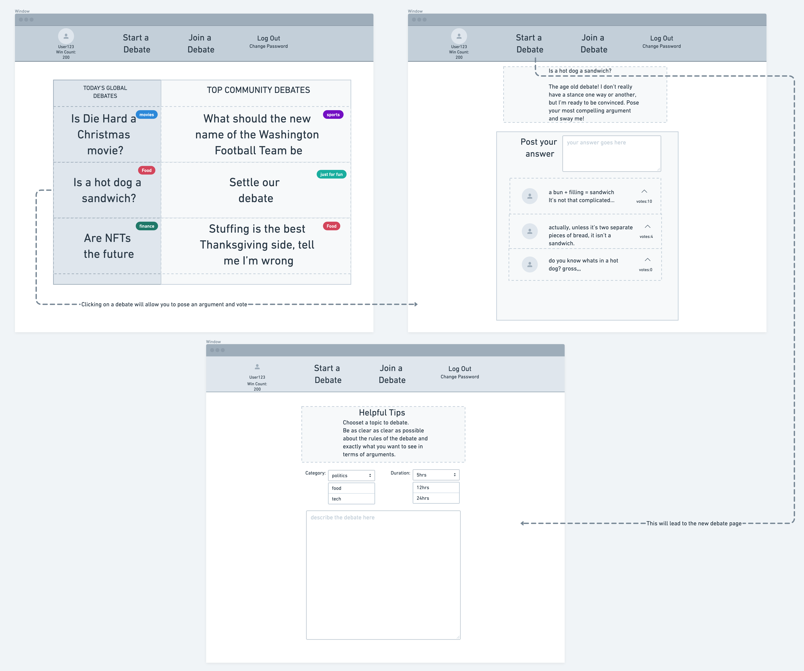
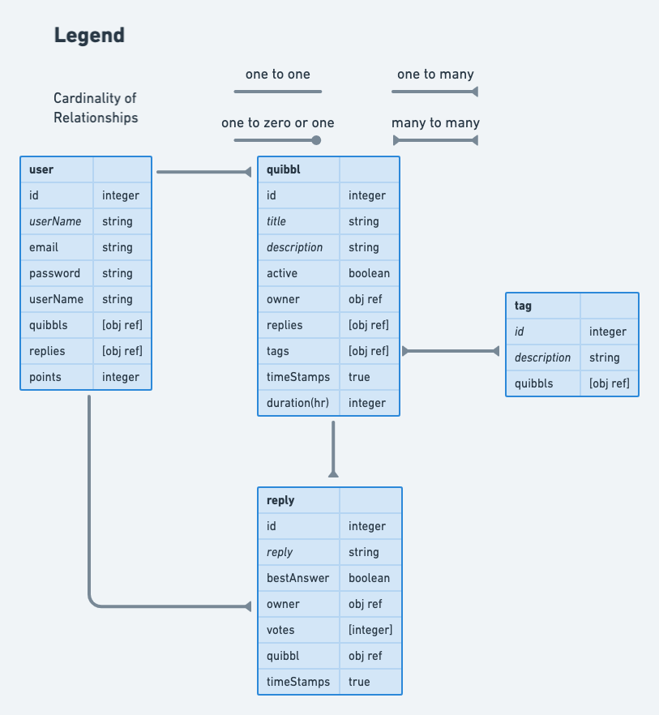

# Quibbl
What some might call trivial arguments, our users call a good time. The goal of Quibbl is to give users a fun interactive place to discuss all sorts of debate topics. From things like which Jedi is actually the strongest, to what color is math! Users will be able to engage in debates and upvote other users that they agree with. 

## Deployed App
<a href="https://quibbl.netlify.app/">Visit Quibbl</a>

## Server Repo
https://github.com/cmiltiadou/quibbl-api

## Install

Requirements
* MongoDB
* NPM
* <a href="https://github.com/cmiltiadou/quibbl-api">Quibbl API </a>

Install procedure:

1. In the directory of your Quibbl API, run the following commands
    * ```npm install``` to install necessary npm packages
    * ```npm start``` to instantiate the server, and leave it running
2. Once the API is up and running, move to the directory where you've saved the Quibbl client and run the following commands
    * ```npm install``` to install necessary npm packages
    *  ```npm start``` to launch the Quibbl react app
3. Jump right in and make a user account and start posting questions!

## Tech Stack
* React
* MongoDB
* Mongoose
* CSS/Bootstrap/Semantic UI

## Wireframes


## Collections


## MVP
* Create a single page MERN application using ReactJS
* Create a database using MongoDB/Mongoose
* Users can pose a topic of debate, and other users can enter the debate by providing their best answer.
* In addition to providing their own answers, users can also upvote answers by other users. 
* CSS elements that react to things like vote count, or time left on a debate. (i.e. votes >  5, card background color turns green)

## Stretch Goals
* The user with the best answer will be awarded points upon the conclusion of the debate
* Different styles of debate, i.e. convince me (only the original poster has final say), community vote (the default game), random user ( a random user has final say), etc.
* Quibbls are all set to a timer depending on the duration chosen. 

## Potential Roadblocks
* Finding a low cost solution to setting all quibbls to a timer


